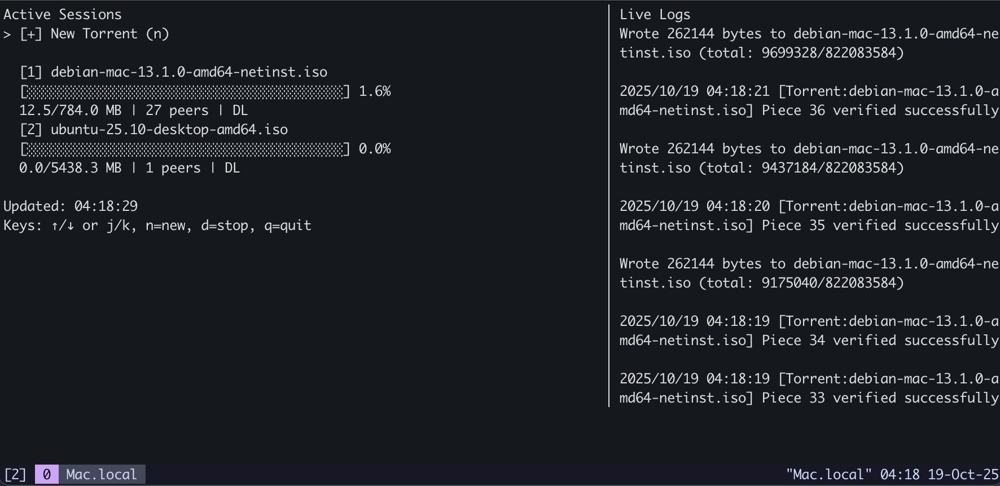

# go-bittorrent

A BitTorrent client with a terminal interface. I wanted something I could run in tmux and seeing as I recently picked up Go I thought this would be a fun project.

<p align="center">
  
</p>

## Build

```bash
go build -o go-bittorrent ./cmd/gotorrent
```

## Usage

Start with a torrent file or launch the TUI and add torrents interactively:

```bash
# Load torrent on startup
./go-bittorrent file.torrent

# Start empty
./go-bittorrent
```

## Configuration

```
-o string          Output directory (default ".")
-port int          Listen port (default 6881)
-max-peers int     Max peers per torrent (default 50)
-block-size int    Block size in bytes (default 16384)
-pipeline int      Request pipeline size (default 5)
-log-level string  Log level: debug, info, warn, error (default "info")
```

## Interface

The TUI shows active torrents on the left with download progress, peer counts, and status. Live logs appear on the right. All logging output goes to `go-bittorrent.log`.

**Controls:**
- `n` - Add torrent via file picker
- `↑/↓` or `j/k` - Navigate sessions
- `enter` - Open selected torrent in file explorer
- `d` - Stop selected torrent
- `q` - Quit

## Implementation

- Tracker communication with HTTP GET announcements
- Peer wire protocol with message framing and piece requests
- Piece validation using SHA-1 hashes from torrent metadata
- Pipelined block requests per peer connection
- Concurrent peer management with connection pooling
- Multi-file torrent support
- TUI built with Bubbletea and live log tailing

## TODO

- Session persistence (resume incomplete downloads from metafile)
- DHT support for trackerless torrents
- Magnet link support
- Upload rate limiting and ratio management

## References

- [BitTorrent Protocol Specification](https://wiki.theory.org/BitTorrentSpecification)
- [BEP 0003: The BitTorrent Protocol](https://www.bittorrent.org/beps/bep_0003.html)
- [Incentives Build Robustness in BitTorrent](https://bittorrent.org/bittorrentecon.pdf)

## Project Structure

```
go-bittorrent/
├── cmd/gotorrent/          # Main entry point
├── internal/
│   ├── bencoding/          # Torrent file parsing
│   ├── daemon/             # Session and peer management
│   ├── libnet/             # Network protocol implementation
│   ├── tui/                # Terminal interface
│   ├── config/             # Configuration handling
│   └── logger/             # Structured logging
└── examples/               # Sample torrent files
```
